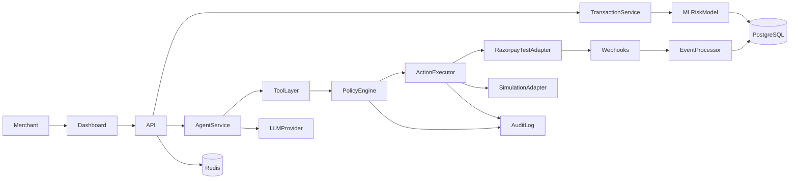

# RecoverAI System Architecture

Official source of truth for **Phase 1**. Later phases implement this design; they do not redefine it.

RecoverAI adheres strictly to the separation of **Statistical Prediction (ML)**, **Contextual Diagnostic Reasoning (AI)**, **Deterministic Guardrail Enforcement (Policy Engine)**, and **Financial Action Execution (Adapters)**.

The LLM proposes actions. The policy engine decides whether they are permitted. The executor is the only component that may call payment adapters.



---

## 1. Architectural Philosophy

```
Payment Event / Webhook
  │
  ▼
1. ML Risk Model ──► recoverability score and expected recoverable amount
  │
  ▼
2. AI Diagnostic Agent (LLM) ──► diagnosis and proposed intervention (structured JSON)
  │
  ▼
3. Deterministic Policy Engine ──► allow / block / require human approval / stop
  │
  ├── IF Escalated ──► WAITING_APPROVAL
  ├── IF Blocked ──► STOP + audit
  └── IF Approved ──► Action Executor
                          │
                          ▼
4. Payment Adapters (Razorpay Test Mode / labelled Simulation)
  │
  ▼
5. Audit trail and measured metrics
```

**Incorrect flow:** Transaction → LLM → direct payment API.

**Demo vs Test Mode:** `PAYMENT_PROVIDER` / `DEMO_MODE` selects Simulation (labelled DEMO) or Razorpay Test Mode (`rzp_test_` only). Recovered revenue is counted only from captured/paid webhooks or from the simulation adapter’s recorded outcome.

---

## 2. Folder structure

```
RecoverAI/
  frontend/          Next.js App Router
  backend/app/
    api/             HTTP routes
    models/          SQLAlchemy entities
    schemas/         Pydantic contracts
    services/        application use-cases
    agents/          LLM agent + tools
    policies/        deterministic rules
    providers/       llm, payments
    workers/         webhook / job processing
    repositories/    reserved for persistence helpers
    core/            config, database, security
  backend/tests/
  backend/alembic/
  ml/                data, features, models
  evaluation/
  scripts/
  docs/
```

---

## 3. Database design

PostgreSQL is the production store. SQLite is allowed only for local/dev/tests. Schema is owned by **Alembic**.

| Table | Role |
| merchants | id, name, business_category, currency, created_at |
| merchant_policies | one row per merchant: MAX_RETRY_ATTEMPTS, HIGH_VALUE_THRESHOLD, MIN_RECOVERY_SCORE, MIN_AI_CONFIDENCE, CONTACT_COOLDOWN_MINUTES, MAX_CONTACT_ATTEMPTS |
| users | MERCHANT_ADMIN, MERCHANT_OPERATOR, VIEWER |
| customers | privacy-safe identifiers (email_hash), history counters, opt-out |
| transactions | payment attempt; metadata is untrusted |
| revenue_risk_assessments | ML output; model_version, features_version |
| recovery_cases | lifecycle statuses listed below |
| recovery_actions | unique (transaction_id, action_type, recovery_attempt) |
| audit_logs | actor_type SYSTEM, AI_AGENT, MERCHANT, ADMIN; correlation_id; never secrets |
| webhook_events | unique razorpay_event_id |

**Case statuses:** OPEN, ANALYZING, WAITING_APPROVAL, SCHEDULED, EXECUTING, RECOVERED, FAILED, STOPPED, ESCALATED.

**Indexes (required):** FK columns, `transactions.status`, `transactions.created_at`, `recovery_cases.status`, `audit_logs.correlation_id`.

**Recovery score (backend only):**  
`recovery_score = P(recovery) × expected_recoverable_amount × action_success_probability`

---

## 4. API design

Contract prefix in this repository: `/api/v1` (equivalent to the plan’s `/api` resources).

| Method | Path | Notes |
| GET | `/health` | Must report dependency health (DB; Redis when configured) |
| GET | `/api/v1/dashboard/metrics` | |
| GET | `/api/v1/transactions`, `/api/v1/transactions/{id}` | pagination + filters |
| GET | `/api/v1/recovery-cases`, `/api/v1/recovery-cases/{id}` | |
| POST | `/api/v1/recovery-cases/{id}/analyze` | agent + policy; no execute |
| POST | `/api/v1/recovery-cases/{id}/approve` | admin only |
| POST | `/api/v1/recovery-cases/{id}/reject` | admin only; STOP |
| POST | `/api/v1/recovery-cases/{id}/execute` | policy + idempotency + adapter |
| GET | `/api/v1/audit-logs` | |
| POST | `/api/v1/simulation/run` | labelled demo batch |
| GET | `/api/v1/evaluation/results` | generated files only |
| POST | `/webhooks/razorpay` | raw body, 2xx fast, work async |

Errors:

```json
{ "error": { "code": "RECOVERY_POLICY_BLOCKED", "message": "...", "request_id": "..." } }
```

Roles: Viewer read-only; Operator view/manage cases (not approve); Admin approve/reject/configure.

---

## 5. Agent architecture

LLM uses **tools only**, never SQL. Tools include get_transaction, get_customer_history, get_payment_history, get_failure_details, calculate_recovery_score, get_merchant_policy, propose_recovery_action, request_human_approval, check_policy, execute_recovery_action (after policy), schedule_retry, send_recovery_notification, stop_recovery_case, create_audit_entry.

`LLMProvider` + Gemini/OpenAI + `MockLLMProvider`. Structured JSON validated by Pydantic. Invalid JSON: reject, log, retry once, then deterministic fallback.

Strategies: RETRY_PAYMENT, DELAYED_RETRY, CUSTOMER_NOTIFICATION, HUMAN_REVIEW, STOP_RECOVERY.

Customer metadata is untrusted and never treated as instructions.

---

## 6. ML architecture

Synthetic ≥10k (target 20k) transactions, `SEED=42`, time-based train/validation/test, no label leakage. Target `recoverable` 0/1. Persist `model_version`. Metrics: precision, recall, F1, ROC-AUC, confusion matrix, FPR.

---

## 7. Policy architecture

LLM cannot override. Ordered rules: retry cap; opt-out → no contact; amount > high-value → approval; confidence < min → approval; recovery_score < min → STOP; cooldown → STOP; ineligible status → STOP; unknown action → BLOCK; max contacts.

Fallback if LLM down: temporary failure + previous_success_count ≥ 3 + retry_count < 2 → DELAYED_RETRY; unknown failure → HUMAN_REVIEW; else STOP.

---

## 8. Razorpay integration architecture

`PaymentProvider`: create_order, fetch_order, fetch_payment, capture_payment (authorized only). Payment Links only if current official docs still support them.

New Order per payment attempt. Do not reuse a failed `order_id`. Capture only if status is `authorized`.

Webhooks: `payment.failed`, `payment.authorized`, `payment.captured`, `order.paid`. HMAC-SHA256 over **raw** body; unique `X-Razorpay-Event-Id`. Out-of-order: fetch payment/order via API before mutating. Silent card retry is out of scope.

---

## 9. Testing strategy

Unit: policy, fallback, risk score, idempotency, webhook signature, duplicates, approvals, stopping rules.  
Integration: API→DB, agent→policy→executor, webhook→worker.  
Security: missing auth, viewer cannot approve, injection, prompt injection in metadata, invalid/replayed webhooks.  
Eval metrics must be generated, never typed by hand.

---

## 10. Security strategy

Env-only secrets; never live Razorpay keys; never secrets in frontend. JWT or equivalent + RBAC. Webhook HMAC. PII hashed/masked. Prompt injection: system/policy immutable.

---

## 11. Development phases (gates)

| Phase | Scope | Exit |
| 1 | This architecture (docs + contracts) | This document + structure tests |
| 2 | Models, Alembic, indexes, constraints | `alembic upgrade head` + model tests |
| 3 | FastAPI, errors, RBAC, health | API tests |
| 4–13 | Data, ML, agent, policy, payments, webhooks, UI, eval, ship | Each phase’s tests |

Do not start phase N+1 until phase N is verified.

---

## 12. Runtime component notes

### Ingestion and webhooks

- **Endpoint**: `POST /webhooks/razorpay`
- **Security**: HMAC-SHA256 over raw body; missing signature is invalid
- **Idempotency**: unique `razorpay_event_id`
- **Async**: accept quickly; process in a worker

### ML recoverability service

Fast statistical recoverability score and expected recoverable amount. Formula in section 3.

### AI diagnostic agent

`LLMProvider` abstraction. Pydantic JSON contract. Fallback when LLM is down (`is_fallback = true`).

### Deterministic policy engine

Opt-out, max retries, high-value approval, low confidence, minimum recovery score, cooldown, eligible status, allowed actions.

### Action execution adapters

Razorpay Test Mode uses documented endpoints only. Simulation adapter is labelled DEMO / SIMULATION and must not look like live money movement.
